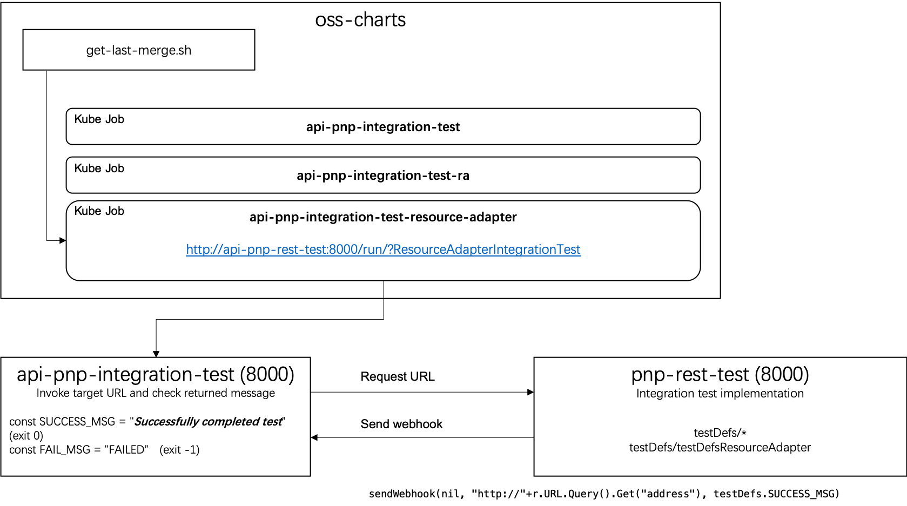

# pnp-rest-test
Tester program for PNP rest api

This tool is actually composed of 2 parts.


### Command line tool 
It can be used to check the that the records in PnP were in good format.   This was created by Ken awhile ago so some of the tests may not be entirely valid still. 

```
go run main.go --test <tests> --token <PNP-TOKEN> --endpoint https://pnp-api-oss.dev.cloud.ibm.com/catalog/api/info
```

The `tests` is a list of test name separated by comma, the values can be `incident`, `resource`, `notification`, `maintenance` or `all`. All of the tests in this mode were in ${pnp-rest-test}/status folder.

### Integration tests.   

The integration tests are kicked off by an http server serving on 8000 and 8443.

for example 

> curl http://SERVER:PORT/run?RunSubscriptionFull

There are a couple integration tests that you can run:

1. basic - This creates a subscription, creates a watch, then posts an incident payload to rabbitMQ.  We expect to receive 2 hook notifications 
2. RunSubscriptionFull - This creates a subscription, creates watches (incident, maintenance, notifications and resources), creates a doctor change request in rabbitMQ, posts a BSPN to hooks and creates an incident.   We expect to get 8 updates to the pnp watches back.
3. ResourceAdapterIntegrationTest - This counts the number of resources in the resource table, then deletes two resources, then imports resources(via resourceAdapter service), lastly it checks the resource table to make sure the resources have been placed back.



#### Integration test lifecycle.

In [oss-charts](https://github.ibm.com/cloud-sre/oss-charts) defined some Kubernetes jobs for every integration test we can run. The integration test starts after the merge to the master branch occurs.  CICD kicks off at that point and deploys the code to the development environment. Then it will trigger the integration job in with it runs the tests defined in [pnp-integration-test](https://github.ibm.com/cloud-sre/api-pnp-integration-test). 

Acutally the job defined the integration test url to be run on `api-pnp-rest-test` in format like: http://api-pnp-rest-test:8000/run/?ResourceAdapterIntegrationTest

The integration test creates a temporary webserver and then calls the integration test on pnp-rest-test via its http url.  At that point, it waits for a successful response for 5 minutes. After which time it fails the integration test.

#### listenForWebhooks function

One key component to the subscription based integration tests are the fact that pnp-rest-test acts as a hooks server.   The subscription consumer delivers it's payloads to the hooks server.  From there it goes into a Messages channel and is processed by the listenForWebhooks function.

Validation strings is essentially an array of strings that the listenForWebhooks function will check every request for to see if it received a post with an expected body.  The function keeps track of the validation strings that will be needed and those that will have been confirmed.

### Develop a new integration test

Even the integration test relys on many other components, you may also be able to develop/test it locally.

#### Create your new test

As mentioned above, the `pnp-integration-test` launch the test on `pnp-rest-test`, listening and check the returned result from `pnp-rest-test` see if the result contains following messages:

```
const SUCCESS_MSG = "Successfully completed test"
const FAIL_MSG = "FAILED"
```

Please refer to the code in [pnp-rest-test/testDefs](https://github.ibm.com/cloud-sre/pnp-rest-test/testDefs) to add any new integration test.


#### Run unit test

You can use gomake to run the unit tests in `pnp-rest-test` before you launch the server.

```
gomake -f ./Makefile test
```

#### To test your integration test locally

Please make sure you have install a local postgres db and created a new database for the pnp.

```
$ psql postgres
postgres=# create database pnptest;
CREATE DATABASE
postgres=# create user pnp with encrypted password 'pnp';
CREATE ROLE
postgres=# grant all privileges on database pnptest to pnp;
GRANT
 ```

Export the following environment:

```
export PG_DB='pnptest'
export PG_DB_PASS='pnp'
export PG_DB_USER='pnp'
export PG_HOST='localhost'
export PG_DB_IP='127.0.0.1'
export PG_DB_PORT='5432'

export SERVER_KEY=<PNP-TOKEN>
export CASE_API_KEY=<CASE_API_KEY>
export subscriptionURL='https://pnp-api-oss.dev.cloud.ibm.com/pnpsubscription/api/v1/pnp/subscriptions/
export HTTP_PROXY=http://<blink-id>:<blink-password>@blink.oss.cloud.ibm.com:1080   # pragma: whitelist secret
export HTTPS_PROXY=http://<blink-id>:<blink-password>@blink.oss.cloud.ibm.com:1080  # pragma: whitelist secret
export CATALOG_URL='https://pnp-api-oss.dev.cloud.ibm.com'

export SN_KEY='<ServiceNow-Token>'
export envType='dev'
export snHost='watsondev'
export snToken='<ServiceNow-Token>'
```

> Note: 
> 1. On your local you need blink as proxy to access the remote api deployed on OSS dev environment. You can get the blink account and password on Doctor.
> 2. You may need other environment variables to get your tests to run locally.

Make the go program and run it:

```
gomake
./main -startServer=true
```

Access url on your browser:

1. Get Help http://localhost:8000/help
2. Run your tests: http://localhost:8000/run/?CaseAPIIntegrationTest